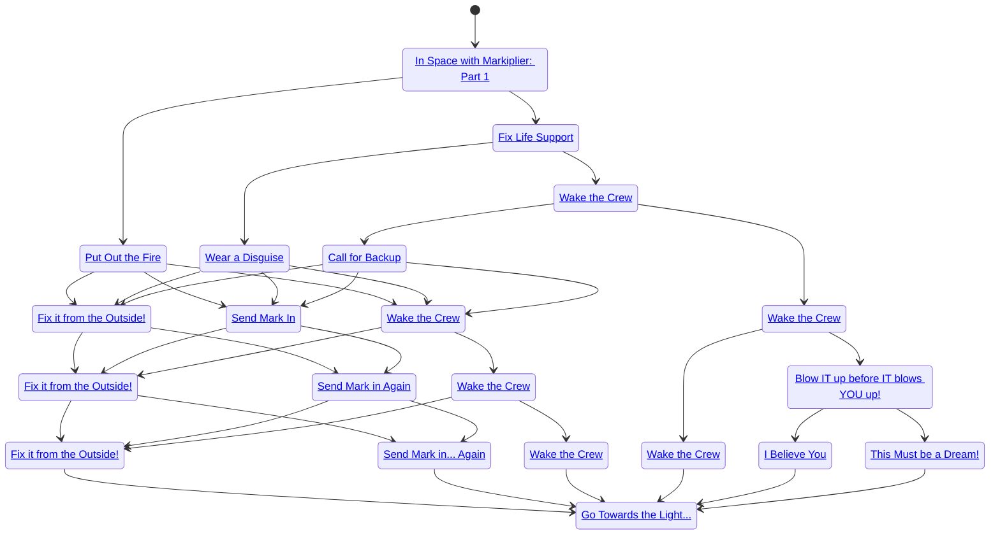

# markiplier-project-diagrams

```mermaid
    stateDiagram-v2
        state "<a href='https://www.youtube.com/watch?v=j64oZLF443g'>In Space with Markiplier: Part 1</a>" as InSpaceWithMarkiplier
        state "<a href='https://www.youtube.com/watch?v=raIqPgW-quI'>Put Out the Fire</a>" as PutOutTheFire
        state "<a href='https://www.youtube.com/watch?v=NK-u4ukbOFw'>Send Mark In</a>" as SendMarkIn
        state "<a href='https://www.youtube.com/watch?v=bYy_aAiTfYA'>Send Mark in Again</a>" as SendMarkInAgain
        state "<a href='https://www.youtube.com/watch?v=7P9mpmsLSno'>Send Mark in... Again</a>" as SendMarkInAgain2
        state "<a href='https://www.youtube.com/watch?v=Rm7nK2x_FWQ'>Fix it from the Outside!</a>" as FixItFromTheOutside
        state "<a href='https://www.youtube.com/watch?v=uIMvjur42Vw'>Fix it from the Outside!</a>" as FixItFromTheOutside2
        state "<a href='https://www.youtube.com/watch?v=Y0Ja_BrgGhA'>Fix it from the Outside!</a>" as FixItFromTheOutside3
        state "<a href='https://www.youtube.com/watch?v=Dq1BrxAXQLg'>Wake the Crew</a>" as WakeTheCrewMark
        state "<a href='https://www.youtube.com/watch?v=Tn1MkhNUaA4'>Wake the Crew</a>" as WakeTheCrewMark2
        state "<a href='https://www.youtube.com/watch?v=ch07UcMzWkQ'>Wake the Crew</a>" as WakeTheCrewMark3
        state "<a href='https://www.youtube.com/watch?v=mGtFUm-sgh4'>Fix Life Support</a>" as FixLifeSupport
        state "<a href='https://www.youtube.com/watch?v=HHlphhgN1kU'>Wake the Crew</a>" as WakeTheCrew
        state "<a href='https://www.youtube.com/watch?v=ogrmyhb5gNI'>Wake the Crew</a>" as WakeTheCrew2
        state "<a href='https://www.youtube.com/watch?v=SKODGzV20LU'>Wake the Crew</a>" as WakeTheCrew3
        state "<a href='https://www.youtube.com/watch?v=5eG8rFt_JuY'>Wear a Disguise</a>" as WearADisguise
        state "<a href='https://www.youtube.com/watch?v=8Figj37SoPg'>Call for Backup</a>" as CallForBackup
        state "<a href='https://www.youtube.com/watch?v=98bVPHiSY_k'>Blow IT up before IT blows YOU up!</a>" as BlowItUp
        state "<a href='https://www.youtube.com/watch?v=98bVPHiSY_k'>I Believe You</a>" as IBelieveYou
        state "<a href='https://www.youtube.com/watch?v=5nZZAmvRIuU'>This Must be a Dream!</a>" as ThisMustBeADream
        state "<a href='https://www.youtube.com/watch?v=HcfjRwNr89Q'>Go Towards the Light...</a>" as GoTowardsTheLight

        [*] --> InSpaceWithMarkiplier
        InSpaceWithMarkiplier --> PutOutTheFire
        InSpaceWithMarkiplier --> FixLifeSupport

        PutOutTheFire --> FixItFromTheOutside
        PutOutTheFire --> SendMarkIn
        PutOutTheFire --> WakeTheCrewMark
        FixItFromTheOutside --> FixItFromTheOutside2
        FixItFromTheOutside --> SendMarkInAgain
        SendMarkIn --> FixItFromTheOutside2
        SendMarkIn --> SendMarkInAgain
        WakeTheCrewMark --> FixItFromTheOutside2
        WakeTheCrewMark --> WakeTheCrewMark2
        FixItFromTheOutside2 --> FixItFromTheOutside3
        FixItFromTheOutside2 --> SendMarkInAgain2
        SendMarkInAgain --> FixItFromTheOutside3
        SendMarkInAgain --> SendMarkInAgain2
        WakeTheCrewMark2 --> FixItFromTheOutside3
        WakeTheCrewMark2 --> WakeTheCrewMark3
        FixItFromTheOutside3 --> GoTowardsTheLight
        SendMarkInAgain2 --> GoTowardsTheLight
        WakeTheCrewMark3 --> GoTowardsTheLight

        FixLifeSupport --> WakeTheCrew
        FixLifeSupport --> WearADisguise
        WakeTheCrew --> CallForBackup
        WakeTheCrew --> WakeTheCrew2
        WearADisguise --> FixItFromTheOutside
        WearADisguise --> SendMarkIn
        WearADisguise --> WakeTheCrewMark
        CallForBackup --> FixItFromTheOutside
        CallForBackup --> SendMarkIn
        CallForBackup --> WakeTheCrewMark
        WakeTheCrew2 --> BlowItUp
        WakeTheCrew2 --> WakeTheCrew3
        BlowItUp --> IBelieveYou
        BlowItUp --> ThisMustBeADream
        WakeTheCrew3 --> GoTowardsTheLight
        IBelieveYou --> GoTowardsTheLight
        ThisMustBeADream --> GoTowardsTheLight
```